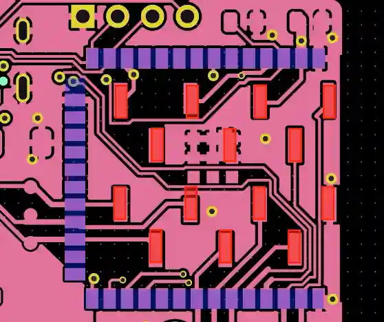

This is a break-out for an ESP32-WROOM or ESP32S3-WROOM module.
These modules can be hard to desolder, if the chip gets damaged during development.
You can mount this break-out board using 2.54mm pitch standard pin connectors (SMD) on a mainboard for easier
replacement.

The footprint of the landing connector on the mainboard fits inside the WROOM-Footprint so it does not need extra space
on the mainboard (only wiring due to the extra pads can be a bit more complicated).
During assembly you can either populate the WROOM module directly on the mainboard or use this break-out board.

|                                           |
|--------------------------------------------------------------------------------------------------|
| blue: WROOM footprint pads  red: 2.54mm SMD pin header pads to receive this break-out board. |

It also works on solderless breadboards.

## Features
* ESP-PROG header
* USB pin header
* USB-C socket
* BOOT button (GPIO0) to enter download mode manually
* 3.3V LDO regulator

# Notes

## LDOs 5V to 3.3V

* NCP167BMX330TBG
* TLV70233_SOT23-5

## 3.3-5V boost

if we put the ESP32S3 in USB host mode and supply 5V on the USB-C port we can connect arbitrary usb devices.
[digikey boost](https://www.digikey.de/short/q9n4rhhj)

* TPS631000DRLR
* TPS61094 (bi-directional) kicad symbol: https://github.com/JY68-Werable-EEG-Sensor/Wearable-EEG-Sensor
    * this might replace the 5V to 3.3V LDO.
