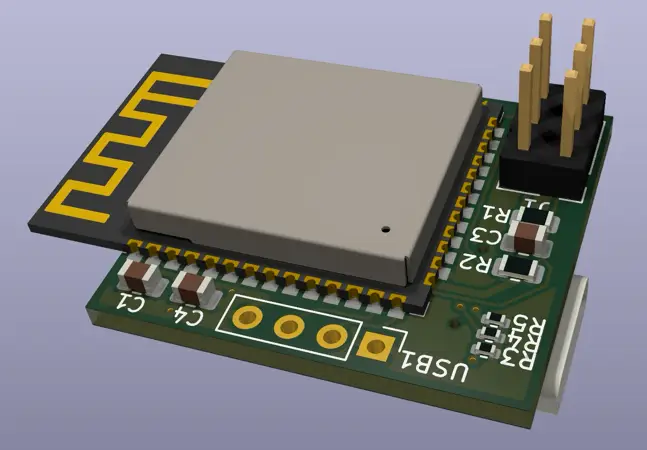
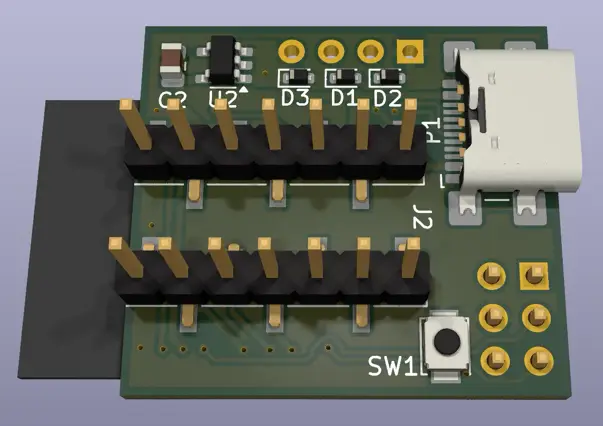

# Notes
## LDOs 5V to 3.3V

* NCP167BMX330TBG
* TLV70233_SOT23-5

## 3.3-5V boost

if we put the ESP32S3 in USB host mode and supply 5V on the USB-C port we can connect arbitrary usb devices.
[digikey boost](https://www.digikey.de/short/q9n4rhhj)

* TPS631000DRLR
* TPS61094 (bi-directional) kicad symbol: https://github.com/JY68-Werable-EEG-Sensor/Wearable-EEG-Sensor
  * this might replace the 5V to 3.3V LDO.